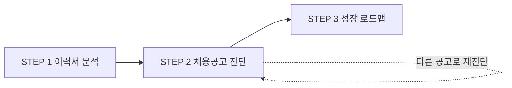

<div align="center">

# CHAE-FIT

**이력서 기반 기업별 직무 적합도 진단 서비스**

*"이 공고, 내 경험으로 지원해도 될까? — 근거와 함께 답해준다."*

<br>

[](https://chae-fit.vercel.app)
[](https://github.com/llll1211llll1211/CHAE-FIT)
[](./CASE_STUDY.md)

[](./docs/PRD_SCREEN_통합.md)
[](./docs/API.md)
[](./docs/기획서.md)
[](https://nextjs.org)
[](https://docs.claude.com)

</div>

---

## 무엇을 푸는가

취업 준비의 병목은 두 단계다. **(1) 어떤 직무를 지원할지 정하는 단계**, **(2) 정한 뒤 "내 경험이 이 공고가 원하는 것과 맞는지" 판단하는 단계.**

사람인·잡코리아·원티드는 (1)을 위한 검색과 필터를 잘 제공한다. 그런데 (2)에 대해서는 아무것도 해주지 않는다.

> 공고: *"반도체 공정 관련 연구실 · 인턴 경험 보유자"*
> 이력서: *"학부연구생으로 증착 실험을 했다"*
>
> **이 둘이 같은 것인지 다른 것인지를 판단해 주는 서비스가 없다.**

그래서 지원자는 확신 없이 지원하거나, 확신이 없어서 지원하지 않는다. CHAE-FIT은 (2)를 정면으로 다룬다.

---

## 어떻게 동작하는가



로그인 없이 **세 단계**를 거친다. 각 단계는 독립 라우트이고, 앞 단계 데이터가 없으면 뒤 단계는 잠긴다.

| 라우트 | 화면 | 내용 |
|---|---|---|
| `/` | 랜딩 | 서비스 소개 · 시작 방법 3갈래 |
| `/start` | 시작 방법 | 이력서 있음 / 없음 / 모르겠음 분기 |
| `/resume` | **STEP 1** 이력서 분석 | 업로드(PDF·txt 5MB) 또는 직접 입력 → 경력 요약 · 연차 · 역량 칩 · 주요 경험 |
| `/posting` | **STEP 2** 채용공고 진단 | 본문 붙여넣기(기본) / URL(보조) → 공고 3줄 요약 + **적합도 진단서**. 진단 후에도 입력이 열려 있어 다른 공고를 바로 비교 |
| `/roadmap` | **STEP 3** 성장 로드맵 | 같은 회사·직무의 **경력 공고**와 대조해 향후 필요 역량 + **국비지원 강의** 추천 |

진행 상태는 `SessionProvider`가 들고 `sessionStorage`에 남긴다. 새로고침·URL 직접 진입·뒤로가기에서 첫 화면으로 튕기지 않되, 탭을 닫으면 사라진다 — "회원가입 없이 세션 동안"과 같은 수명이다.

---

## 핵심 설계 — 숫자는 코드가, 문장은 LLM이

이 프로젝트의 단 하나의 원칙이다.

```
matchedSkills = R ∩ U          ← 집합 연산 (결정적)
missingSkills = R − U          ← 집합 연산 (결정적)
fitScore      = 충족 ÷ 요구 × 가중치   ← 산술 (결정적)
reasons       = "이 경험이 저 요구사항과 대응합니다"   ← LLM
```

**LLM은 점수를 만들지 않는다.** 적합도와 충족/부족 목록은 스킬 사전을 통과한 집합 연산으로 확정되고, LLM은 *이미 확정된 매칭을 설명하는 문장*만 쓴다.

이 분리가 두 가지를 동시에 막는다.

- **근거 없는 "당신은 70% 적합합니다"** — 점수의 출처가 코드라 항상 추적된다.
- **근거 문장의 환각** — LLM에는 확정된 매칭 결과와 이력서 경험 항목만 넘어가고, 새로운 사실 생성이 금지된다.

덤으로 **같은 이력서 · 같은 공고면 점수가 항상 같다.** 시연 중에 숫자가 흔들리지 않는다.

> 가중치: 요구 역량이 3개 이상이면 1.0, 2개면 0.8, 1개면 0.6.
> 요구사항 1개짜리 공고가 100%로 뜨는 건 잘 맞는 게 아니라 **정보가 없는 것**이기 때문이다.

성장 로드맵(STEP 3)도 같은 규칙을 따른다.

```
futureSkills = 경력공고 태그 − 신입공고 태그 − 내 보유 태그   ← 집합 연산 (결정적)
courses      = 태그별 강의 교집합                          ← 집합 연산 (결정적)
reason       = "이게 왜 필요해지는지" 1문장                  ← LLM
```

근거 문장 생성이 실패해도 역량 목록과 강의는 그대로 나간다. 목록은 이미 코드가 확정했기 때문이다.

---

## 오독을 막는 UX

적합도 점수는 잘못 읽히면 사용자에게 해를 끼친다. 세 가지 장치를 뒀다.

| 위험 | 장치 |
|---|---|
| 점수를 **합격률**로 읽는다 | 점수 옆에 *"요구 역량 7개 중 4개 충족"* 상시 병기 + 하단 1줄 고지 |
| 부족 역량이 **자격 미달 통보**로 읽힌다 | 레이블을 "필요 역량"으로, 칩은 외곽선만. **경고색(빨강) 금지** |
| **정보 없음**이 "적합도 0%"로 읽힌다 | 요구 역량 추출 실패 시 점수·역량 영역을 통째로 숨기고 안내 문구 |
| 아무 경력 공고나 붙여 **틀린 로드맵**을 보여준다 | 회사·직무가 코퍼스와 매칭되지 않으면 그냥 "정보 없음". 비슷한 걸 골라 채우지 않는다 |
| 강의 추천이 **제휴 광고**로 읽힌다 | HRD-Net 공공 데이터만 쓰고 수수료를 받지 않는다. 해당 과정이 없으면 없다고 표시 |

---

## 빠른 시작

```bash
git clone https://github.com/llll1211llll1211/CHAE-FIT.git
cd CHAE-FIT/web
npm install
npm run dev          # http://localhost:3000
```

### API 키 없이도 전부 동작한다

`ANTHROPIC_API_KEY`가 없으면 세 라우트가 **자동으로 목업 응답**을 낸다. 목업은 실제 LLM 응답과 **같은 스키마**이므로, 키를 넣는 순간 프론트 코드는 한 줄도 바뀌지 않는다.

```bash
cp .env.example .env.local   # 키를 넣으면 실제 Claude 호출로 전환
npm run smoke                # 스킬 사전·매칭 스모크 테스트
```

> **적합도 점수와 충족/필요 역량은 목업이 아니다.** 처음부터 실제 집합 연산이라, 키가 없어도 그 값들은 진짜다.

| 환경변수 | 기본 | 설명 |
|---|---|---|
| `ANTHROPIC_API_KEY` | *(없음)* | 없으면 목업 모드 |
| `NEXT_PUBLIC_DEMO_PREFILL` | 개발 환경만 | 샘플 이력서·공고 프리필. 실서비스는 반드시 `0` |
| `WORK24_USE_FIXTURE` | `true` | 고용24 오픈API (MVP 범위 밖, F7) |

---

## API

Base URL: `https://chae-fit.vercel.app` · 로컬 `http://localhost:3000`

| 라우트 | 입력 | 출력 |
|---|---|---|
| `POST /api/resume/analyze` | 이력서 파일 (`multipart/form-data`) | 경력 요약 · 연차 · 정규화된 역량 · 경험 항목 |
| `POST /api/posting/parse` | 공고 `text` 또는 `url` (정확히 하나) | 회사·제목 · 3줄 요약 · 자격요건 · 우대사항 · 요구 역량 |
| `POST /api/fit/diagnose` | 위 두 응답 | 점수 · 충족/필요 역량 · 근거 문장 |
| `POST /api/career/outlook` | 위 두 응답 | 경력 공고 대비 향후 필요 역량 · 국비지원 강의 |

**이력서는 세션당 1회만 분석한다.** 공고를 바꿔 진단할 때 클라이언트가 `analysis`를 보관했다가 재전송한다. 공고 N건 진단 = 이력서 분석 1회 + 공고 분석 N회.

`parse`와 `diagnose`를 나눈 이유: 공고 요약은 진단 없이도 유용하고, **진단이 실패해도 요약만이라도 보여줄 수 있다.**

<div align="right">

[](./docs/API.md)

</div>

---

## 기술 스택

| 영역 | 선택 | 이유 |
|---|---|---|
| 프레임워크 | **Next.js 16 (App Router)** · React 19 | 화면 + API 라우트 단일 리포 |
| LLM | **Claude API** (`@anthropic-ai/sdk`) | structured outputs로 스키마 강제 |
| 모델 | **`claude-opus-5`** | 이력서와 공고의 자연어 대조는 판단 난이도가 높다 |
| PDF | `unpdf` | 동적 import — txt 경로에서는 로드하지 않는다 |
| 배포 | Vercel | |

호출별 `effort`는 지연과 품질의 균형을 보고 나눴다.

| 호출 | effort | 이유 |
|---|:-:|---|
| 이력서 분석 | `high` | 세션당 1회. 이후 모든 진단의 입력이라 품질 우선 |
| 공고 파싱 | `medium` | 원문 추출이 주된 일이고 공고마다 반복 호출 |
| 근거 문장 | `medium` | 진단 1건 10초 내외 목표 |

근거 문장 호출은 **시스템 프롬프트 + 이력서 분석 결과 뒤에 캐시 지점**을 둔다. 공고를 바꿔도 프리픽스가 그대로라 비용과 지연이 함께 줄어든다.

---

## 프로젝트 구조

```
axtone-project/
├── web/                              # Next.js 앱
│   └── src/
│       ├── app/
│       │   ├── page.jsx              # 랜딩 (사이드바 없음)
│       │   ├── start/ resume/        # 시작 방법 · STEP 1
│       │   ├── posting/ roadmap/     # STEP 2 · STEP 3
│       │   └── api/                  # 라우트 4종
│       ├── components/               # 화면 + 사이드바 · 마스코트 · 로딩 · 에러
│       └── lib/
│           ├── api/
│           │   ├── contract.js       # ★ 스키마 · 에러 · 적합도 산출 (정본)
│           │   ├── claude.js         # Claude 호출 + 프롬프트
│           │   └── mock.js           # 키 없을 때의 목업 (트랙 2종)
│           ├── session/              # 라우트 간 상태 공유 + 단계 가드
│           ├── skills/               # 스킬 사전 + 정규화 (진단 플로우)
│           ├── jobs/                 # 96-태그 사전 · 경력공고 코퍼스 매칭
│           ├── courses/              # 국비지원 강의 매칭
│           ├── resume/extract-text.js
│           └── posting/fetch-url.js
└── docs/
    ├── 기획서.md                      # 정본
    ├── PRD_SCREEN_통합.md             # PRD v0.3
    ├── API.md
    ├── 공고데이터/                     # 시드 코퍼스 86건 + 역량 태그 96개
    └── 디자인/                         # 화면 목업 (디자인 캔버스 export)
```

**`contract.js`가 이 리포의 중심이다.** 거기 정의된 스키마 객체 하나가 *Claude structured output 스키마*이자 *API 응답 형태*로 동시에 쓰인다. 둘이 같은 객체이므로 명세와 실물이 어긋날 수 없다. `docs/API.md`는 사본이고, 코드가 정본이다.

---

## 데이터 자산

`docs/공고데이터/`에 정형화된 채용공고 **86건**과 역량 태그 사전 **96개**가 있다.

- 사전 96개가 코퍼스에서 전부 1회 이상 사용되며, 코퍼스에 사전 밖 태그는 없다 (공고당 평균 6.5개).
- **시드 코퍼스는 공고 파서의 few-shot 예시로 재활용**할 수 있다.
- 데모 대상 공고는 `verification: A`(공식 JD 확인) 등급이라 데이터 출처를 물어도 답이 된다.
- 코퍼스는 **신입·경력 페어 86쌍**이다. 같은 회사·직무의 두 공고를 나란히 놓아 "지금 신입으로 필요한 것"과 "4~9년 뒤 요구되는 것"의 차집합을 뽑는다 — 성장 로드맵의 근거다.
- HRD-Net 국비지원 훈련과정 **152건**을 같은 태그 사전으로 스캔해 붙였다. 다만 96개 태그 중 강의가 붙는 건 37개뿐이고, `협업·리딩`·`특허·지식재산` 같은 소프트스킬은 해당 과정 자체가 없다. **강의가 없으면 없다고 표시한다.**

---

## 범위와 로드맵

**있는 것** — F1 이력서 업로드 · F2 경력 분석 · F3 공고 입력 · **F4 적합도 진단서(핵심)** · F5 공고 요약 · F6 통합 대시보드 · **F9 경력 공고 대비 성장 로드맵** · **F11 갭 → 국비지원 강의 추천**

**없는 것** — 로그인·계정, 공고 크롤링, 다국어, **합격 가능성 예측**

| 단계 | 기능 |
|---|---|
| 다음 | F7 공고 탐색 오픈API (워크넷/공공데이터포털, Adzuna) |
| 확장 | F8 자소서 문항별 근거 매핑 · F10 관심 기업 북마크·트래킹 |

> 원래 F9·F11은 장기 과제였다. 경력 공고 코퍼스를 확보하면서 *"무엇이 비었는지"*(F4)와 *"그래서 뭘 하라"*(F11)를 이을 근거가 생겨 앞당겼다. 다만 **진단과 처방은 여전히 화면을 나눈다** — STEP 2는 대조 결과까지, STEP 3부터가 처방이다.

---

## 개인정보

업로드된 이력서는 분석 목적으로만 임시 사용하며 **저장하지 않는다.** 공고 원문도 저장하지 않는다. 세션이 끝나면 남는 것이 없다.

---

<div align="center">

**이 진단은 공고에 명시된 요구사항과의 비교이며, 합격 가능성 판정이 아닙니다.**

<br>

[](https://chae-fit.vercel.app)
[](./CASE_STUDY.md)

</div>
