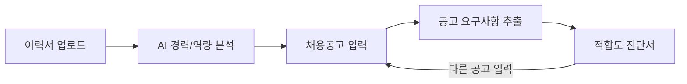
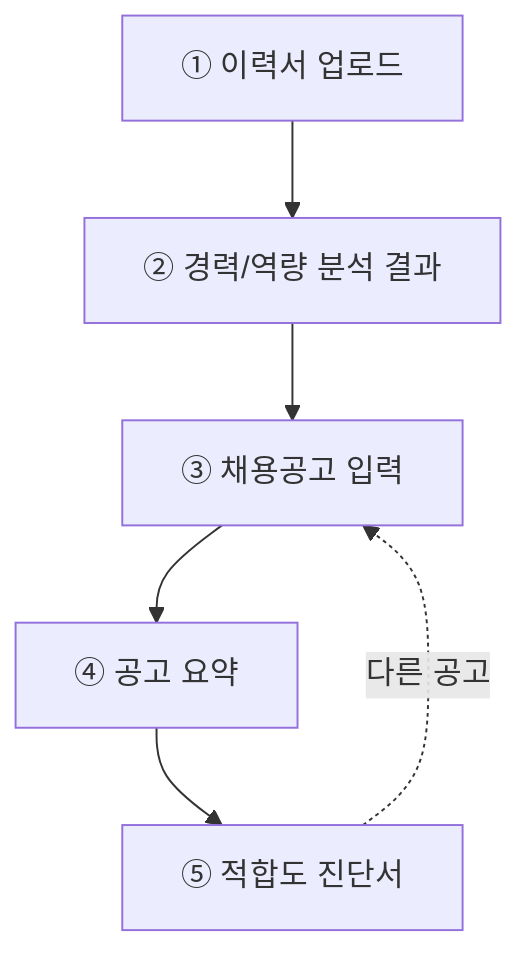

# PRD: 채피티 — 이력서 기반 기업별 직무 적합도 진단 서비스

| 항목 | 내용 |
|---|---|
| 문서 버전 | v0.3 (기획서 방향 반영 · 전면 개정) |
| 작성일 | 2026-08-12 |
| 최종 개정 | 2026-08-19 |
| 작성 목적 | 해커톤/공모전 출품용 PRD |
| 서비스명 | 채피티 (chafit) |
| 배포 | https://chafit.vercel.app |

> **v0.3 개정 배경**
> v0.2까지는 **"직무를 모르는 사용자에게 직무를 추천한다"** 는 서비스였다. `docs/기획서.md`가 정의한 타겟은 정반대로 **"산업·직무는 이미 정했으나 자기 경험이 그 분야 요구 역량과 맞는지 확신이 없는 사용자"** 이며, 핵심 기능도 직무 추천이 아니라 **기업별 적합도 진단서**다.
> 두 문서가 서로 다른 서비스를 정의하고 있었으므로, **기획서를 정본으로 삼아 PRD를 전면 개정한다.** v0.2의 직무 추천 기능과 직종코드 사전은 폐기하고, 스킬 사전 · 갭 산출 · 결정적 스코어링 원칙은 그대로 계승한다. (v0.2 원본은 `docs/PRD_v0.2_직무추천방향.md.bak`에 보존)

---

## 1. 개요 (Overview)

사용자가 **이력서를 업로드**하고 **지원하려는 채용공고를 입력**하면, AI가 둘을 대조해 **적합도 진단서**를 만들어 준다. 진단서는 적합도 점수, 충족한 역량, 부족한 역량, 그리고 **"왜 그렇게 판단했는지"의 근거 문장**으로 구성된다.

한 줄 요약: *"이 공고, 내 경험으로 지원해도 될까? — 근거와 함께 답해준다."*

### 출품 배경

취업 준비생이 겪는 병목은 두 단계다. (1) 어떤 직무를 지원할지 정하는 단계, (2) 정한 뒤 **"내 경험이 이 공고가 원하는 것과 맞는지"** 판단하는 단계.

기존 채용 플랫폼은 (1)에 필요한 검색 · 필터는 잘 제공하지만, (2)에 대해서는 아무것도 해주지 않는다. 공고에는 *"반도체 공정 관련 연구실 · 인턴 경험 보유자"* 라고 적혀 있고, 이력서에는 *"학부연구생으로 증착 실험을 했다"* 고 적혀 있다. **이 둘이 같은 것인지 다른 것인지를 판단해 주는 서비스가 없다.** 그래서 지원자는 확신 없이 지원하거나, 확신이 없어서 지원하지 않는다.

채피티는 (2)를 정면으로 다룬다.

---

## 2. 문제 정의 (Problem Statement)

- **역량 언어의 불일치**: 공고는 직무 표준 용어로 쓰이고, 이력서는 개인 경험 서사로 쓰인다. 지원자는 둘을 대조할 기준이 없다.
- **판단 근거의 부재**: "될 것 같다 / 안 될 것 같다"는 감이 있을 뿐, 무엇이 충족되고 무엇이 비었는지 항목 단위로 확인할 방법이 없다.
- **잘못된 판단의 비대칭 비용**: 과소평가하면 지원 기회를 잃고, 과대평가하면 시간과 심리적 자원을 잃는다. 특히 경력자는 잘못된 지원의 기회비용(경력 공백 · 평판)이 커서 근거 없이는 움직이지 않는다.
- **기존 서비스의 한계**: 사람인 · 잡코리아 · 원티드는 **공고를 찾아주는** 서비스다. 찾은 공고와 내 이력서를 **대조해 주는** 기능은 없다.

---

## 3. 목표 및 성공 지표 (Goals & Success Metrics)

| 목표 | 지표 (MVP/데모 기준) |
|---|---|
| 진단의 설득력 확보 | 진단서의 근거 문장이 실제 이력서 문장과 공고 문장을 짚어 연결한다 |
| 판단 시간 단축 | 이력서 업로드부터 진단서 확인까지 3단계 이내 |
| 심사 관점 완결성 | 업로드 → 공고 입력 → 진단서까지 끊김 없는 End-to-End 데모 |
| 갭의 실행 가능성 | 부족 역량이 "막연한 부족"이 아니라 **공고가 명시한 항목**으로 특정된다 |

---

## 4. 타겟 사용자 (Target Users)

### 4.0 핵심 타겟 정의

**"지원할 곳은 정했는데, 내 경험이 거기에 통할지 모르겠는 사람."**

두 페르소나의 공통 조건은 (1) 업로드할 이력서/경력기술서가 존재하고, (2) **목표 산업 · 직무가 이미 정해져 있으며**, (3) 그 목표 대비 자기 역량의 위치를 판단하지 못하는 상태다.

> **v0.2에서 뒤집힌 지점**: v0.2는 "지원 직무가 이미 확정된 사용자"를 명시적 제외 대상으로 두었다. v0.3에서는 **바로 그 사용자가 핵심 타겟**이다. 가치 제안이 "직무를 찾아준다"에서 "정한 직무에 대한 적합도를 판정해 준다"로 이동했기 때문이다.

---

### 4.1 페르소나 A — 신입 지원자 · **P0, 데모 주인공**

| 항목 | 내용 |
|---|---|
| 상황 | 지방 4년제 신소재공학 4학년 2학기. **반도체 공정기술** 직무로 방향은 확정했고, 삼성전자 DS · SK하이닉스 · 원익IPS를 추려 놓음 |
| 보유 경험 | 학부연구생 1년(박막 증착 실험 수행, CVD 장비 운용 보조), 캡스톤(박막 두께 편차 분석), 반도체공정 · 재료분석 교과목 이수, 통계 수업에서 실험계획법 과제 1건, 토익 850 |
| 현재 해결 방식 | 공고의 자격요건을 눈으로 훑고 "학부연구생이 경험으로 쳐주나?" 자문 → 결론이 안 나서 지원을 미룸 |
| 핵심 Pain | ① 공고의 *"반도체 공정 관련 연구실 · 인턴 경험 보유자"* 와 자기 경험 *"학부연구생으로 증착 실험을 했다"* 가 같은 것인지 판단하지 못한다. ② 수업 과제로 해본 DOE가 *"통계 기반 실험계획법 활용 가능자"* 를 충족하는지 **어디까지가 '경험'인지 경계를 모른다.** |
| 니즈 | "이 공고 기준으로 내가 몇 %쯤 되는지, 그리고 **무엇 때문에** 그런지 알고 싶다" |
| Aha 모먼트 | 학부연구생 경험이 공고의 특정 요구사항과 **직접 연결되어** 근거 문장으로 제시되고, 수업 수준의 DOE는 **증빙 강도가 낮게** 잡히는 것을 함께 볼 때 |
| 대표 인용 | *"학부연구생 1년이 이 공고에서 '경험 있음'으로 쳐주는 건지 아닌지를 모르겠어요."* |

**A의 이용 시나리오**
1. 이력서 PDF를 업로드한다.
2. 삼성전자 DS부문 **반도체 공정기술(메모리사업부)** 공고를 붙여넣는다.
3. 진단서에서 **충족 역량**(박막증착 CVD/ALD, 재료분석, 통계)과 **필요 역량**(포토, 식각, CMP, 수율관리)이 분리되어 보인다.
4. 근거 문장을 읽는다 — *"학부연구생 시절 수행한 박막 증착 실험이 요구 역량 중 '단위공정 이론에 대한 이해'와 직접 대응합니다."* → **여기가 데모의 하이라이트.**
5. 원익IPS 공정개발(CVD/ALD) 공고를 하나 더 넣어 비교한다.

> 이 페르소나는 `docs/공고데이터/`의 시드 코퍼스 86건에 맞춰 설계했다. 대상 공고(삼성전자 DS 공정기술)는 코퍼스에서 `verification: A`(공식 JD 확인) 등급이라 심사에서 데이터 출처를 물어도 답이 된다.

---

### 4.2 페르소나 B — 직무 전환 희망자 · **P1**

| 항목 | 내용 |
|---|---|
| 상황 | 제조기업 품질관리 3년차. 데이터 분석 직무로의 전환을 목표로 확정했으나 아직 지원 전 |
| 보유 경험 | 공정 불량 데이터 분석 및 리포팅, 사내 공정 개선 프로젝트 2건 주도, 협력사 품질 감사 |
| 보유 스킬 | SQL, Excel/VBA, SPC, 6시그마 GB, Python 독학 6개월 |
| 현재 해결 방식 | 데이터 분석가 공고를 눈팅만 함. 요구사항 대비 **자기 경력이 몇 %나 충족되는지 판단이 안 서서** 지원을 못 한다 |
| 핵심 Pain | ① 3년 경력이 "품질관리"라는 이름표에 갇혀 있고, 인접 직무에서 어디까지 인정되는지 모른다. ② **잘못된 지원의 기회비용이 크다.** 그래서 "될 것 같다"가 아니라 **정량 지표와 근거**가 있어야 움직인다. |
| 니즈 | "내 경력이 이 공고에 통하는지, 그 판단 근거를 보고 싶다" |
| Aha 모먼트 | 공정 데이터 분석 경험이 데이터 분석가 공고의 요구사항과 매핑되어, 전환 가능성이 **숫자와 항목으로** 제시될 때 |
| 대표 인용 | *"3년 쌓은 게 여기서만 쓸모 있는 건지, 옆 직무로도 통하는 건지가 제일 궁금해요."* |

**B의 이용 시나리오**
1. 경력기술서를 업로드한다.
2. 데이터 분석가 공고 3개를 차례로 입력한다.
3. 각각의 적합도와 부족 역량을 **비교**해, 어느 쪽이 현실적인 진입점인지 판단한다. → **§9의 "공고 재입력 · 비교" 동선이 필요한 이유가 B다.**

---

### 4.3 페르소나 → 기능 커버리지

| 니즈 | A | B | MVP 대응 |
|---|:-:|:-:|---|
| 이 공고에 내가 맞는지 | ◎ | ◎ | F4 (적합도 진단서) |
| 왜 그렇게 판단했는지 근거 | ◎ | ◎ | F4 (근거 문장) — 신뢰의 핵심 |
| 무엇이 충족/부족한지 | ◎ | ◎ | F4 (충족 역량 / 필요 역량) |
| 긴 공고를 빠르게 파악 | ○ | ○ | F5 (공고 자동 요약) |
| 여러 공고 비교 | ○ | ◎ | F4 재입력 (§9) |
| 부족 역량을 채울 방법 | ○ | ○ | **미대응** (F11, 향후) |

---

### 4.4 타겟이 아닌 사용자 (Anti-persona)

| 대상 | 제외 이유 |
|---|---|
| 목표 직무가 전혀 정해지지 않은 사용자 | 대조할 공고가 없어 F3(공고 입력)이 성립하지 않음. **v0.2가 겨냥했던 사용자이며, v0.3에서는 범위 밖이다.** |
| 이력서에 쓸 경험이 아직 없는 저학년 대학생 | 업로드할 입력물 자체가 없어 F1이 성립하지 않음 |
| 경력 10년 이상 시니어 · 임원급 | 적합도 판정이 아니라 네트워크 · 서치펌 영역 |

---

### 4.5 데모 샘플 준비물

| 페르소나 | 샘플 이력서 | 샘플 공고 |
|---|---|---|
| A (주 시연) | 신소재공학 졸업예정자 이력서 1부 | 반도체 공정기술 · 공정개발 공고 2~3건 (코퍼스 `IND01`) |
| B (보조 시연) | 제조 QA 3년차 경력기술서 1부 | 제조DX · 데이터 엔지니어링 공고 2~3건 (코퍼스 `JOB05`) |

> 공고는 **실제 공고 본문**을 사용한다. 진단 품질이 공고 본문의 구체성에 직결되므로, 자격요건이 항목으로 정리된 공고를 고른다(§12).

---

## 5. 핵심 사용자 흐름 (User Flow)



1. 사용자가 이력서 파일(PDF/텍스트)을 업로드한다.
2. 서버가 텍스트를 추출해 LLM으로 경력 · 역량 · 경험을 구조화한다. **이 결과는 세션에 보관되어 이후 모든 진단에 재사용된다**(§8.5).
3. 사용자가 지원하려는 채용공고를 입력한다 — 본문 붙여넣기 또는 URL.
4. 공고에서 요구 역량 · 자격요건 · 우대사항을 추출한다.
5. 이력서와 공고를 대조해 적합도 진단서를 생성한다.
6. 사용자는 다른 공고를 입력해 반복 비교한다 (3번으로 돌아감).

---

## 6. 기능 요구사항 (Functional Requirements)

| ID | 기능 | 설명 | 입력 | 출력 | MVP 범위 |
|---|---|---|---|---|---|
| F1 | 이력서 업로드 | PDF/텍스트 업로드 및 텍스트 추출 | 이력서 파일 | 원문 텍스트 | ✅ 필수 |
| F2 | AI 경력 · 역량 분석 | LLM으로 경력 · 보유 역량 · 주요 경험을 구조화 | 이력서 텍스트 | 경력 요약, 역량 태그, 경험 항목 | ✅ 필수 |
| F3 | 채용공고 입력 | 공고 본문 또는 URL 입력 · 본문 확보 | 텍스트 또는 URL | 공고 원문 | ✅ 필수 |
| F4 | **기업별 적합도 진단서** | 이력서 × 공고 대조 → 적합도 점수 · 충족/필요 역량 · **근거 문장** | 이력서 분석 결과, 공고 원문 | 진단서 | ✅ **핵심 기능** |
| F5 | 채용공고 자동 요약 | 긴 공고를 핵심 자격요건 · 우대사항 3줄 내외로 요약 | 공고 원문 | 요약문 | ✅ 필수 (난이도 하) |
| F6 | 결과 대시보드 | 분석 결과 · 요약 · 진단서를 한 화면에서 확인 | 위 결과 종합 | 통합 화면 | ✅ 필수 |
| F7 | 공고 탐색(오픈API) | 워크넷/공공데이터포털 · Adzuna로 공고를 검색해 F3에 투입 | 검색 조건 | 공고 리스트 | ⏭ 배포 후 (§11) |
| F8 | 자소서 문항별 근거 매핑 | 자소서 문항에 연결할 경험과 초안 제안 | 문항, 이력서 | 초안(라벨 명시) | ⏭ 확장 |
| F9 | 직무 요구사항 대비 경쟁력 | 목표 직무 일반 요구 스펙 대비 현재 위치 시각화 | 목표 직무 | 비교 뷰 | ⏭ 확장 |
| F10 | 관심 기업 북마크 · 트래킹 | 기업 저장, 경험 추가 시 적합도 변화 추적 | - | - | ⏭ 장기 (계정 필요) |
| F11 | 갭 보완 활동 추천 | 부족 역량을 채울 비교과 활동 추천 | 부족 역량 | 활동 리스트 | ⏭ 장기 |

**MVP 경계**: F4가 *"무엇이 비었는지"* 까지 보여주고, *"그래서 뭘 하라"* 는 F11(향후)이다. 진단과 처방을 분리한다.

---

## 7. 비기능 요구사항 (Non-functional Requirements)

- **개인정보 처리**: 업로드된 이력서는 분석 목적으로만 임시 사용하며, 세션 종료 시 삭제한다. 공고 원문도 저장하지 않는다.
- **응답 속도**: 이력서 분석은 수 초~수십 초, **공고 1건 진단은 10초 내외**를 목표로 한다. 이력서 분석 결과를 재사용해 공고마다 재분석하지 않는다(§8.5).
- **데모 안정성**: 해커톤 시연 특성상 대규모 트래픽 대응보다 "정해진 데모 시나리오에서의 안정적 동작"을 우선한다.
- **결정성**: 같은 이력서 · 같은 공고에 대해 **적합도 점수와 충족/필요 역량 목록은 항상 동일해야 한다**(§8.4). 근거 문장만 생성형이다.

---

## 8. 데이터 및 기술 범위 (Data & Tech Scope)

### 8.1 스택

| 영역 | 선택 | 비고 |
|---|---|---|
| 프레임워크 | **Next.js 16 (App Router)** | 화면 + API 라우트 단일 리포. 배포 Vercel |
| LLM | **Claude API** (`@anthropic-ai/sdk`) | 기획서 §6에서 지정 |
| 모델 | **`claude-opus-5`** | 이력서 · 공고의 자연어 대조는 판단 난이도가 높다 |
| 공고 수집(향후) | 워크넷/공공데이터포털, Adzuna | F7, §11 |

### 8.2 이력서 파싱 (F1 · F2)

업로드 파일 → 텍스트 추출 → Claude API로 구조화. **structured outputs**로 스키마를 강제해 파싱 실패를 원천 차단한다.

```
resumeAnalysis = {
  summary:     string,        // 경력 요약 문장
  totalYears:  number,
  skills:      string[],      // 정규화 전 원문 표기
  experiences: [              // 근거 문장 생성의 원재료
    { title, description, skills[] }
  ]
}
```

- **`experiences`가 핵심이다.** F4의 근거 문장이 *"학부연구생 시절 수행한 박막 증착 실험이 …"* 처럼 **구체적 경험을 지목**하려면, 스킬 태그만으로는 부족하고 경험 단위 서술이 필요하다.
- `skills`는 스킬 사전(§8.5)을 통과시켜 정규형 집합 **U**로 만든다.

### 8.3 공고 요구사항 추출 (F3 · F5)

| 입력 방식 | 처리 |
|---|---|
| **본문 붙여넣기** (기본) | 그대로 사용 |
| **URL** (보조) | 서버에서 본문을 가져와 텍스트 추출. 실패 시 "본문을 직접 붙여넣어 주세요"로 폴백 |

공고 원문 → Claude API로 요구사항 구조화 + 요약(F5)을 **한 번의 호출로** 처리한다.

```
jobPosting = {
  company, title,
  summary:      string[],     // F5: 3줄 요약
  requirements: string[],     // 자격요건 원문 문장
  preferred:    string[],     // 우대사항 원문 문장
  skills:       string[]      // 요구 역량 (정규화 전)
}
```

`skills`를 스킬 사전으로 정규화해 요구 역량 집합 **R**을 만든다.

> **URL 수집의 한계**: 채용 플랫폼 대부분이 스크래핑을 약관으로 제한하거나 JS 렌더링을 요구한다. **MVP의 기본 입력은 본문 붙여넣기**로 두고, URL은 보조 수단으로 제공한다. 데모는 붙여넣기로 시연한다(§12).

### 8.4 적합도 산출 (F4) — 숫자는 결정적으로

| 산출물 | 담당 | 방식 |
|---|---|---|
| `matchedSkills` | **룰(집합 연산)** | R 과 U 의 교집합 |
| `missingSkills` | **룰(집합 연산)** | R 에서 U 를 뺀 차집합 |
| `fitScore` | **룰** | 충족 개수 ÷ 요구 개수. 요구 역량이 3개 미만인 공고는 가중치 하향 |
| `reasons` (근거 문장) | **LLM** | 경험 항목 ↔ 요구사항 문장 매핑 서술 |

**LLM이 점수를 만들지 않는다.** 적합도 숫자와 충족/부족 목록은 집합 연산으로 확정하고, LLM은 **이미 확정된 매칭에 대한 설명**만 쓴다. 근거 없는 "당신은 70% 적합합니다"를 원천 차단하기 위함이며, §7의 결정성 요구를 만족시킨다.

근거 문장 생성 시 LLM에 넘기는 것은 **확정된 매칭 결과 + 이력서 경험 항목 + 공고 요구사항 문장** 셋뿐이다. LLM은 이 셋을 연결하는 문장만 쓰고, 새로운 사실을 만들지 않는다(§12).

### 8.5 스킬 사전 및 성능

- **스킬 사전**(`skill-dictionary.json`)이 표기 흔들림을 정규형에 매핑한다: `파이썬` · `python` · `Python3` → `Python`. 이력서 쪽 U 와 공고 쪽 R **양쪽 모두** 같은 사전을 통과해야 집합 연산이 성립한다.
- **이력서 분석은 세션당 1회.** 결과를 클라이언트 상태에 보관하고, 공고를 바꿔 입력할 때 재분석하지 않는다. 공고 N건 진단 = 이력서 분석 1회 + 공고 분석 N회.
- **프롬프트 캐싱**: 이력서 분석 결과가 매 진단 요청의 프롬프트에 반복 포함되므로, 안정적인 앞부분(시스템 프롬프트 + 이력서 분석 결과)에 캐시 지점을 두어 비용과 지연을 줄인다.

### 8.6 API 라우트

| 라우트 | 입력 | 출력 |
|---|---|---|
| `POST /api/resume/analyze` | 이력서 파일 | `resumeAnalysis` |
| `POST /api/posting/parse` | 공고 본문 또는 URL | `jobPosting` (요약 포함) |
| `POST /api/fit/diagnose` | `resumeAnalysis`, `jobPosting` | 진단서 |

`parse`와 `diagnose`를 분리하는 이유: 공고 요약(F5)은 진단 없이도 독립적으로 유용하고, 진단이 실패해도 요약만이라도 보여줄 수 있다.

### 8.7 공고 데이터 자산 (`docs/공고데이터/`)

| 파일 | 내용 |
|---|---|
| `chafit_01_스키마_분류체계.md` | JD 표준 스키마, 산업 8분류 · 직무 7분류, 적합도 산출 공식 |
| `chafit_02_채용공고_시드코퍼스.md` | 정형화 공고 86건 (사람이 읽는 형태) |
| `chafit_jd_corpus.jsonl` | 같은 86건 (기계 판독용) |
| `chafit_competency_tags.json` | 역량 태그 사전 96개 — `tag_id` · `label` · `category` · `aliases` |

- 사전 96개가 코퍼스에서 전부 1회 이상 사용되며, 코퍼스에 사전 밖 태그는 없다. 공고당 평균 6.5개.
- **시드 코퍼스는 F3 공고 파서의 few-shot 예시로 재활용한다.** 사용자가 붙여넣은 임의 공고를 같은 스키마로 파싱시키는 데 그대로 쓸 수 있다.
- 이 스키마는 §8.4의 원칙(*태그 매칭은 코드가, 문장 생성은 LLM이*)을 그대로 따르며, 아래를 추가로 제공한다.

| 항목 | 현재 `contract.js` | 코퍼스 스키마 |
|---|---|---|
| 요구사항 | `skills[]` 단일 집합 | **`must` / `preferred` 분리** (가중치 0.45 / 0.25) |
| 정량 자격 | 없음 | 학력 · 전공 미달 시 **점수 이전에 하드 필터 경고** |
| 경험 깊이 | 없음 | 인턴 1.0 / 캡스톤 0.8 / 수업 0.5 / 자격증만 0.3 |
| 신뢰도 | 없음 | `verification` A · B · C 배지 |

> **결정(2026-08-19)**: 코퍼스 스키마를 채택하고 `contract.js`를 그에 맞춰 확장한다. 86건이 이미 이 형태로 존재하고, `must`/`preferred` 분리와 하드 필터는 본 PRD가 놓쳤던 실질적 개선이다. **적용은 미완료** — API 계약(`docs/API.md`)은 아직 확장 전 형태다.

---

## 9. 화면 설계 (Screen Design)

> 로그인 · 회원가입 없이 **단일 페이지**에서 아래 섹션이 순차적으로 열리는 대시보드다.



상태 흐름: `idle → analyzing → analyzed → parsing → parsed → diagnosing → diagnosed` (+ `error`)

### 9.1 섹션별 설계

**① 이력서 업로드 (UploadSection)** — *구현 완료*
- **노출 조건**: `status`가 `idle` 또는 `analyzing`일 때.
- **표시 내용**: 드래그앤드롭 영역, 선택된 파일명, "분석하기" 버튼.
- **제약**: PDF 또는 `.txt`만 허용, 5MB 이하.

**② 경력/역량 분석 결과 (AnalysisSummary)**
- **노출 조건**: `analyzed` 이후 계속 표시.
- **표시 내용**: 경력 요약 문장, 총 경력 연차, 역량 태그(칩), **주요 경험 항목 목록**.
- 경험 항목을 노출하는 이유: ⑤의 근거 문장이 이 항목들을 지목하므로, 사용자가 "AI가 내 이력서를 이렇게 읽었구나"를 먼저 확인해야 진단서를 신뢰한다.

**③ 채용공고 입력 (PostingInput)**
- **노출 조건**: `analyzed` 이후.
- **표시 내용**: 탭 2개 — `공고 내용 붙여넣기` / `공고 URL`. **기본 탭은 붙여넣기**(§8.3).
- **사용자 액션**: 입력 → "진단하기" → `/api/posting/parse` → `/api/fit/diagnose`.
- **재입력**: 진단 후에도 이 섹션은 계속 열려 있어 다른 공고를 바로 넣을 수 있다. **페르소나 B의 비교 동선이므로 필수.**

**④ 공고 요약 (PostingSummary)**
- **노출 조건**: `parsed` 이후.
- **표시 내용**: 회사명, 공고명, 3줄 요약, 자격요건 · 우대사항 목록.

**⑤ 적합도 진단서 (FitReport)** — **핵심 화면**
- **노출 조건**: `diagnosed`.
- **표시 내용**:
  - **적합도 점수** — 큰 숫자 + 게이지. 옆에 *"공고가 명시한 요구 역량 N개 중 M개 충족"* 을 병기해 숫자의 의미를 고정한다.
  - **충족 역량** — 채워진 칩(강조색).
  - **필요 역량** — 외곽선만 있는 칩(중립색). **경고색(빨강) 금지** — 탈락 사유가 아니라 참고 정보로 읽혀야 한다(§12).
  - **근거** — 문장 목록. 각 문장은 *"[내 경험] ↔ [공고 요구사항]"* 을 연결한다.
  - **하단 고지 1줄** — *"이 진단은 공고에 명시된 요구사항과의 비교이며, 합격 가능성 판정이 아닙니다."*
- **요구 역량을 추출하지 못한 경우**: 점수와 역량 영역을 숨기고 *"이 공고에서 요구 역량을 추출하지 못했어요. 자격요건이 포함된 본문을 붙여넣어 주세요."* 를 안내한다. 정보 없음을 "적합도 0%"로 오독시키지 않는다.

**로딩 (LoadingIndicator)**
- `analyzing` → "이력서를 분석하고 있어요..." / `parsing` → "채용공고를 읽고 있어요..." / `diagnosing` → "적합도를 진단하고 있어요..."

**에러 배너 (ErrorBanner)**
- 실패 사유 한 줄 안내. 닫기 가능, 재시도 시 사라짐.

### 9.2 화면에 없는 것 (Out of Scope)

- 로그인/회원가입, 마이페이지
- 별도 라우팅 (모두 한 화면 내 섹션 전환)
- 관심 공고 저장, 알림, 히스토리 (F10, 향후)
- 자소서 초안 UI (F8, 확장)
- 부족 역량을 채울 활동 추천 UI (F11, 장기) — MVP는 갭을 **보여주기만** 한다
- 서비스 내 지원(apply) 기능

### 9.3 컴포넌트 ↔ 상태 매핑

| 컴포넌트 | 노출 조건 | 데이터 소스 |
|---|---|---|
| UploadSection | idle, analyzing | - |
| LoadingIndicator | analyzing, parsing, diagnosing | - |
| AnalysisSummary | analyzed 이후 | `resumeAnalysis` |
| PostingInput | analyzed 이후 | - |
| PostingSummary | parsed 이후 | `jobPosting` |
| FitReport | diagnosed | `fitReport` |
| ErrorBanner | errorMessage 존재 시 | `errorMessage` |

---

## 10. 범위 제외 (Out of Scope for MVP)

- 채용공고 크롤링 및 자동 수집 — MVP는 사용자가 공고를 가져온다
- 사용자별 데이터 축적을 통한 개인화 학습
- 다국어 지원
- 회원가입/로그인 기반 이력 관리
- **합격 가능성 예측** — 본 서비스는 공고 명시 요구사항과의 대조만 수행한다(§12)

---

## 11. 향후 계획 (Future Roadmap)

기획서 §5 우선순위 로드맵을 따른다.

| 단계 | 기능 | 비고 |
|---|---|---|
| MVP 핵심 | 이력서 분석 + 기업별 적합도 진단서 (F1~F4, F6) | 해커톤 메인 데모 |
| MVP 보조 | 채용공고 자동 요약 (F5) | 난이도 낮음 |
| 배포 후 | **공고 탐색 오픈API 연동 (F7)** — 워크넷/공공데이터포털, Adzuna | 공고를 직접 찾아 F3에 투입 |
| 확장 | 자소서 문항 매핑 (F8), 경쟁력 비교 (F9) | 발표 임팩트 강화 |
| 장기 | 북마크 · 트래킹 (F10), 갭 리포트 → 활동 추천 (F11) | 계정 기능 필요 |

- 스킬 사전 확장 — 실제 공고에서 미추출된 표기를 수집해 추출률 개선
- 진단 정확도 고도화 — 사용자 피드백 기반

---

## 12. 리스크 및 고려사항 (Risks & Considerations)

- **개인정보 이슈**: 이력서에는 이름 · 연락처 · 학교 등 민감정보가 포함될 수 있어, 최소 수집 · 임시 저장 · 삭제 원칙을 명확히 한다.

- **공고 본문 확보의 불확실성 (F3)**: 채용 플랫폼 대부분이 스크래핑을 약관으로 제한하거나 JS 렌더링을 요구해, URL 입력이 실패할 수 있다. 완화책 — (1) **기본 입력을 본문 붙여넣기로 두고 URL은 보조**, (2) URL 실패 시 붙여넣기로 즉시 폴백, (3) **데모는 붙여넣기로 시연**해 무대에서 네트워크에 의존하지 않는다.

- **진단 품질이 공고 본문에 종속**: 자격요건이 *"성실한 분"* 수준으로만 적힌 공고는 요구 역량 추출이 되지 않아 진단이 무의미해진다. 완화책 — (1) 요구 역량을 추출하지 못하면 점수를 숨기고 안내(§9.1 ⑤), (2) 데모용 공고는 요구사항이 구체적인 것으로 선별(§4.5).

- **적합도 점수의 오독**: 사용자가 점수를 **합격 가능성**으로 읽으면 잘못된 의사결정을 유발한다. 완화책 — (1) 점수 옆에 *"요구 역량 N개 중 M개 충족"* 을 항상 병기해 의미를 고정, (2) 하단에 합격 예측이 아님을 1줄 고지, (3) 홍보 문구에서도 "합격률" 표현을 쓰지 않는다.

- **부족 역량 표시의 부작용**: 부족 역량이 "너는 자격 미달"로 읽히면 지원 의욕을 꺾는 역효과가 난다. 완화책 — (1) 색 · 문구를 중립적으로(§9.1 ⑤, 경고색 금지), (2) 레이블을 "부족 역량"이 아니라 **"필요 역량"** 으로, (3) 갭은 공고 명시 요구사항과의 단순 비교일 뿐임을 고지.

- **LLM 근거 문장의 환각**: 근거 문장이 이력서에 없는 경험을 지어내면 서비스 신뢰가 무너진다. 완화책 — (1) LLM에 **확정된 매칭 결과와 이력서 경험 항목만** 전달하고 새로운 사실 생성을 금지(§8.4), (2) 근거 문장이 지목하는 경험을 ②에 미리 노출해 사용자가 대조 가능하게 함, (3) 숫자는 LLM이 만들지 않음.

- **LLM 비용 · 지연**: 공고를 바꿀 때마다 호출이 발생한다. 완화책 — 이력서 분석 1회 재사용 + 프롬프트 캐싱(§8.5).
